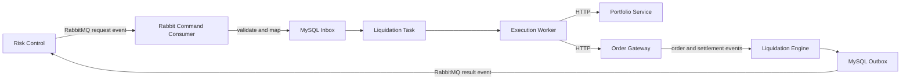

# Perp Liquidation Node

面向永续合约的独立清算引擎。项目使用 Node.js、TypeScript、MySQL、Redis 和
RabbitMQ，实现强平命令接入、幂等处理、决策序列控制、风险单元锁、减仓订单执行、
未知订单恢复、结算确认和可靠结果发布。

当前版本重点完成了风控模块与清算模块之间的 RabbitMQ 事件对接。风控到清算采用
异步消息，不是同步 RPC；清算 Worker 调用 Portfolio 和 Order Gateway 时使用同步
HTTP JSON 接口。

## 当前状态

- 风控强平事件 `risk.liquidation.requested.v1` 已支持。
- 清算结果事件 `liquidation.execution.result.v1` 已支持。
- RabbitMQ 手动 ACK、有限重试、DLQ 和 publisher confirm 已支持。
- MySQL Inbox/Outbox、命令幂等和同一风险单元决策序列已支持。
- Redis Streams 命令、订单事件和结算事件入口继续保留。
- `STATIC` reduce-only 执行策略已支持。
- `ADAPTIVE` 和 `CANCEL_RISK_ORDERS` 尚未实现，入口会明确拒绝。

## 架构



运行进程：

| 进程 | 职责 |
|---|---|
| `api` | HTTP 命令、订单事件、结算事件、任务查询和审批接口 |
| `rabbit-consumer` | 消费风控强平事件，校验后写入 Inbox 和任务 |
| `stream-consumer` | 消费 Redis Streams 命令、订单事件和结算事件 |
| `worker` | 领取任务、执行/恢复订单并投递 Outbox |

更长期的多可用区设计见
[生产升级设计](docs/liquidation-engine-production-upgrade-design.md)。

## 风控消息契约

### RabbitMQ 拓扑

| 配置 | 默认值 |
|---|---|
| Exchange | `perpetual.events` |
| Exchange type | `topic` |
| Request routing key | `risk.liquidation.requested.v1` |
| Command queue | `liquidation.commands.q` |
| Result routing key | `liquidation.execution.result.v1` |
| Dead-letter exchange | `perpetual.dead-letter` |
| Dead-letter queue | `liquidation.commands.dlq` |
| Retry exchange | `perpetual.retry` |
| Retry queue | `liquidation.commands.retry.q` |

请求 Schema：
[risk-liquidation-requested-v1.schema.json](contracts/json-schema/risk-liquidation-requested-v1.schema.json)

请求示例：
[risk-liquidation-requested-v1.json](contracts/examples/risk-liquidation-requested-v1.json)

结果 Schema：
[liquidation-execution-result-v1.schema.json](contracts/json-schema/liquidation-execution-result-v1.schema.json)

结果示例：
[liquidation-execution-result-v1.json](contracts/examples/liquidation-execution-result-v1.json)

风控正式接入时应显式发送：

```json
{
  "decisionSequence": "42",
  "riskUnitId": "acc_001:BTCUSDT",
  "positionVersion": "1"
}
```

- `decisionSequence` 必须在同一 `riskUnitId` 下严格递增。
- `positionVersion` 使用十进制字符串，避免 JavaScript 大整数精度损失。
- `eventId` 是请求幂等键，同一个 `eventId` 不得复用为不同内容。
- 兼容模式会从 `positionVersion` 和 `accountId:symbol` 派生缺失字段，但会记录告警，
  不应作为正式生产契约。
- `riskSnapshot` 仅用于审计，清算执行仍会重新读取仓位和市场快照。
- `maxSlippageBps` 会与清算服务全局上限比较，使用更严格的值。

### ACK 和重试

1. 消息通过 Schema 和版本校验。
2. Inbox、决策序列、任务和初始 Outbox 在一个 MySQL 事务内提交。
3. 事务提交成功后才 ACK RabbitMQ 消息。
4. 临时错误进入 TTL retry queue，默认最多重试 5 次。
5. 非法参数、未知版本或超过重试次数的消息进入 DLQ。
6. 过期和旧决策先 confirm 发布 `EXPIRED`/`SUPERSEDED` 结果，再 ACK 请求。
7. 结果发布使用 `mandatory + publisher confirm`；没有结果队列绑定时不会静默成功。

风控侧必须预先声明并绑定自己的持久化结果队列，否则清算结果会保持重试状态。

## 目录结构

```text
src/
  api/                 Fastify HTTP API
  application/         用例和应用编排
    ports/             外部服务端口
  bootstrap/           API、Consumer、Worker 进程入口
  config/              环境变量校验
  domain/              命令、执行规则、集成契约和共享值对象
  infrastructure/      HTTP、MySQL、RabbitMQ、Redis 适配器
  repositories/        持久化端口
  observability/       日志和可观测性
contracts/
  examples/            契约示例
  json-schema/         JSON Schema
db/migrations/         MySQL 初始化迁移
test/unit/             单元测试
test/e2e/              真实依赖端到端测试
bin/                   本地部署和 smoke 脚本
```

## 环境要求

- Node.js 24+
- pnpm 11.9+
- Docker Desktop 或兼容的 Docker Engine
- MySQL 8.4
- Redis 7.4
- RabbitMQ 4.x（本地 smoke 可通过 `RABBITMQ_IMAGE` 覆盖）

## 安装和检查

```bash
corepack enable
pnpm install --frozen-lockfile
pnpm run check
```

`pnpm run check` 会依次执行 ESLint、TypeScript 构建和全部单元测试。

## 本地启动

只启动消息接入、数据库和 API，不启动依赖外部交易服务的 Worker：

```bash
docker compose up -d mysql redis rabbitmq api stream-consumer rabbit-consumer
```

默认本地地址：

| 服务 | 地址 |
|---|---|
| API | `http://127.0.0.1:3010` |
| RabbitMQ AMQP | `amqp://127.0.0.1:5673` |
| RabbitMQ Management | `http://127.0.0.1:15673` |
| MySQL | `127.0.0.1:3307` |
| Redis | `127.0.0.1:6380` |

Compose 中 RabbitMQ 的本地开发账号为 `liquidation/liquidation`，不得用于生产。

验证 RabbitMQ 请求和结果链路：

```bash
pnpm run smoke:rabbit
```

启动 Worker 前必须提供可访问的 Portfolio、Order Gateway 和内部 Event Publisher：

```bash
pnpm run dev:worker
```

其他开发命令：

```bash
pnpm run dev:api
pnpm run dev:rabbit-consumer
pnpm run dev:stream-consumer
pnpm run smoke:binance
pnpm run test:e2e:real
```

## 关键配置

完整配置见 [.env.example](.env.example)。生产环境至少需要检查：

| 变量 | 说明 |
|---|---|
| `SERVICE_AUTH_TOKEN` | 服务间 HTTP Token，生产至少 16 个字符 |
| `MYSQL_*` | MySQL 连接配置 |
| `REDIS_URL` | Redis 连接地址 |
| `RABBITMQ_URL` | RabbitMQ URL，生产建议使用独立 vhost 和 TLS |
| `RABBITMQ_*` | Exchange、Queue、Routing Key、重试和 DLQ 配置 |
| `PORTFOLIO_BASE_URL` | Portfolio 服务地址 |
| `ORDER_GATEWAY_BASE_URL` | Order Gateway 地址 |
| `EVENT_PUBLISHER_BASE_URL` | 内部非终态事件发布服务地址 |
| `MAX_SLIPPAGE_BPS` | 清算服务允许的最大滑点 |
| `MAX_ORDER_QUANTITY` | 单次订单最大数量 |
| `STREAM_CONSUMER` | Redis consumer 实例名，每个进程必须唯一 |

## HTTP API

业务接口在配置 `SERVICE_AUTH_TOKEN` 后需要请求头 `x-service-token`。

```text
POST /v1/commands
POST /v1/events/orders
POST /v1/events/settlements
GET  /v1/markets/:market/snapshot
GET  /v1/tasks/:taskId
POST /v1/approvals
GET  /v1/approvals/:approvalId
POST /v1/approvals/:approvalId/approve
POST /v1/approvals/:approvalId/reject
```

审批接口还要求由可信网关注入 `x-operator-id`，请求人和审批人必须不同。

## 执行安全性

- 金额、价格和数量在 JSON 边界使用十进制字符串，并通过 `decimal.js` 运算。
- 下单始终使用 `reduceOnly=true`。
- 仓位版本、账户、市场和减仓方向会在下单前重新校验。
- HTTP 下单超时不会盲目重试，而是进入 `UNKNOWN` 并按确定性
  `client_order_id` 查询恢复。
- 同一风险单元使用 Redis 锁和 MySQL fencing token 防止过期 Worker 写入。
- 订单 `FILLED` 后必须等待 Settlement 推进仓位版本，任务才会完成。

## 已知限制

- 订单事件当前没有平均成交价字段，因此结果 `averagePrice` 暂为 `null`。
- `ADAPTIVE` 策略和 `CANCEL_RISK_ORDERS` 尚未实现。
- RabbitMQ 风控链路已有本地 smoke，但真实风控服务仍需完成联合测试。
- `test:e2e:real` 会访问 Binance 公共 API，需要 Docker 和外网访问能力，不会发送真实订单。

## 生产部署注意事项

- 不要使用 Compose 示例密码，凭据应由 Secret Manager 注入。
- RabbitMQ 使用独立 vhost、最小权限账号和 TLS。
- 双方必须冻结 Exchange/Queue arguments；已有队列参数不一致会导致启动失败。
- MySQL 初始化目录只在新数据卷首次创建时执行迁移，生产应使用专用迁移工具。
- 每个 Rabbit/Redis consumer 实例必须有唯一身份，并配置监控、告警和 DLQ 处理流程。
- 在接入真实资金前，必须完成重复、乱序、过期、断网、数据库故障和 broker 重启测试。
