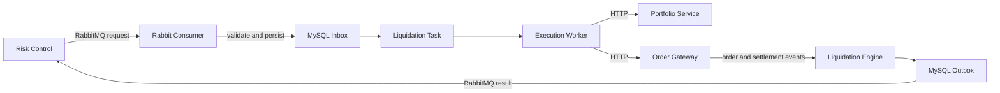

# Perp Liquidation

[](https://github.com/finish-blip/perp-liquidation/actions/workflows/ci.yml)


面向永续合约的独立强平执行服务。项目通过 RabbitMQ 接收风控强平决策，使用 MySQL
保证命令幂等与任务状态一致性，通过 Redis 完成风险单元锁和事件流处理，并调用 Portfolio
与 Order Gateway 执行 `reduce-only` 减仓订单。

> [!WARNING]
> 本项目仍处于 `0.1.0` 开发阶段。接入真实资金前，必须完成上下游联合测试、故障注入、
> 安全审计和生产级凭据配置。

## 目录

- [核心能力](#核心能力)
- [系统架构](#系统架构)
- [快速开始](#快速开始)
- [运行进程](#运行进程)
- [消息契约](#消息契约)
- [HTTP API](#http-api)
- [配置说明](#配置说明)
- [开发与测试](#开发与测试)
- [项目结构](#项目结构)
- [安全设计](#安全设计)
- [已知限制](#已知限制)
- [生产部署](#生产部署)
- [贡献](#贡献)
- [许可证](#许可证)

## 核心能力

- **异步风控接入**：支持 `risk.liquidation.requested.v1` RabbitMQ 事件。
- **可靠消息处理**：支持手动 ACK、有限重试、DLQ、publisher confirm 和
  MySQL Inbox/Outbox。
- **幂等与顺序控制**：使用 `eventId` 去重，并按 `riskUnitId` 校验严格递增的决策序列。
- **并发隔离**：通过 Redis 锁与 MySQL fencing token 防止同一风险单元被并发执行。
- **安全减仓**：执行前重新校验仓位、市场、方向和版本，下单始终设置
  `reduceOnly=true`。
- **未知订单恢复**：HTTP 下单结果未知时，通过确定性的 `client_order_id` 查询恢复，
  不盲目重复下单。
- **结算确认**：订单成交后等待 Settlement 推进仓位版本，再完成清算任务。
- **可观测性**：提供结构化日志、健康检查、就绪检查和 Prometheus 指标。

当前仅实现 `STATIC` 执行策略。`ADAPTIVE` 和 `CANCEL_RISK_ORDERS` 会被明确拒绝。

## 系统架构



风控到清算使用异步消息，不使用同步 RPC。Worker 与 Portfolio、Order Gateway 和内部
Event Publisher 之间使用同步 HTTP JSON 接口。

多可用区、容量规划和灾难恢复方案见
[生产升级设计](docs/liquidation-engine-production-upgrade-design.md)。

## 快速开始

### 环境要求

- Node.js 24+
- pnpm 11.9+
- Docker Desktop 或兼容的 Docker Engine

本地 Compose 使用 MySQL 8.4、Redis 7.4 和 RabbitMQ 4.x。

### 1. 安装依赖

```bash
corepack enable
pnpm install --frozen-lockfile
```

### 2. 启动本地基础服务

以下命令会启动 MySQL、Redis、RabbitMQ、API 和两个消息消费者，但不会启动依赖外部
交易服务的 Worker：

```bash
docker compose up -d mysql redis rabbitmq api stream-consumer rabbit-consumer
```

| 服务 | 本地地址 |
|---|---|
| API | `http://127.0.0.1:3010` |
| 健康检查 | `http://127.0.0.1:3010/healthz` |
| 就绪检查 | `http://127.0.0.1:3010/readyz` |
| Prometheus 指标 | `http://127.0.0.1:3010/metrics` |
| RabbitMQ AMQP | `amqp://127.0.0.1:5673` |
| RabbitMQ Management | `http://127.0.0.1:15673` |
| MySQL | `127.0.0.1:3307` |
| Redis | `127.0.0.1:6380` |

RabbitMQ 的本地开发账号为 `liquidation/liquidation`。该凭据仅用于本地环境。

### 3. 验证服务

```bash
curl http://127.0.0.1:3010/healthz
pnpm run smoke:rabbit
```

`smoke:rabbit` 会验证 RabbitMQ 请求、过期处理和结果发布链路。

### 4. 启动 Worker

Worker 启动前，必须通过环境变量提供可访问的 Portfolio、Order Gateway 和 Event
Publisher 地址。例如在 PowerShell 中：

```powershell
$env:PORTFOLIO_BASE_URL = "http://127.0.0.1:3101"
$env:ORDER_GATEWAY_BASE_URL = "http://127.0.0.1:3102"
$env:EVENT_PUBLISHER_BASE_URL = "http://127.0.0.1:3103"
pnpm run dev:worker
```

项目不会自动加载 `.env` 文件；[.env.example](.env.example) 用于展示全部可配置项。

## 运行进程

| 进程 | 启动命令 | 职责 |
|---|---|---|
| API | `pnpm run dev:api` | HTTP 命令、事件、任务查询和审批接口 |
| Rabbit Consumer | `pnpm run dev:rabbit-consumer` | 接收风控强平事件并写入 Inbox 和任务 |
| Stream Consumer | `pnpm run dev:stream-consumer` | 消费 Redis Streams 命令、订单和结算事件 |
| Worker | `pnpm run dev:worker` | 领取任务、执行或恢复订单并投递 Outbox |

生产构建后的入口分别为 `start:api`、`start:rabbit-consumer`、
`start:stream-consumer` 和 `start:worker`。

## 消息契约

### RabbitMQ 拓扑

| 配置 | 默认值 |
|---|---|
| Exchange | `perpetual.events` (`topic`) |
| Request routing key | `risk.liquidation.requested.v1` |
| Command queue | `liquidation.commands.q` |
| Result routing key | `liquidation.execution.result.v1` |
| Dead-letter exchange | `perpetual.dead-letter` |
| Dead-letter queue | `liquidation.commands.dlq` |
| Retry exchange | `perpetual.retry` |
| Retry queue | `liquidation.commands.retry.q` |

契约文件：

- 请求：[JSON Schema](contracts/json-schema/risk-liquidation-requested-v1.schema.json) / [示例](contracts/examples/risk-liquidation-requested-v1.json)
- 结果：[JSON Schema](contracts/json-schema/liquidation-execution-result-v1.schema.json) / [示例](contracts/examples/liquidation-execution-result-v1.json)
- 其他命令和事件：[contracts/json-schema](contracts/json-schema) / [contracts/examples](contracts/examples)

正式接入时，风控事件必须显式提供以下顺序字段：

```json
{
  "decisionSequence": "42",
  "riskUnitId": "acc_001:BTCUSDT",
  "positionVersion": "1"
}
```

- `decisionSequence` 必须在同一 `riskUnitId` 下严格递增。
- `positionVersion` 使用十进制字符串，避免 JavaScript 大整数精度损失。
- `eventId` 是请求幂等键，不得复用于不同消息内容。
- `riskSnapshot` 仅用于审计；执行阶段会重新读取仓位和市场快照。
- `maxSlippageBps` 与服务全局上限比较后取更严格的值。

兼容模式可从 `positionVersion` 和 `accountId:symbol` 派生缺失字段，但会记录告警，
不应作为正式生产契约。

### ACK、重试与 DLQ

1. Consumer 校验消息 Schema 和版本。
2. Inbox、决策序列、任务和初始 Outbox 在同一 MySQL 事务中提交。
3. 事务提交成功后才 ACK RabbitMQ 消息。
4. 临时错误进入 TTL retry queue，默认最多重试 5 次。
5. 非法参数、未知版本或超过重试次数的消息进入 DLQ。
6. 过期或旧决策先 confirm 发布 `EXPIRED` 或 `SUPERSEDED` 结果，再 ACK 请求。
7. 结果发布使用 `mandatory + publisher confirm`，无队列绑定时不会静默成功。

风控侧必须提前声明并绑定持久化结果队列，否则清算结果会保持重试状态。

## HTTP API

| 方法 | 路径 | 说明 |
|---|---|---|
| `GET` | `/healthz` | 存活检查 |
| `GET` | `/readyz` | 依赖就绪检查 |
| `GET` | `/metrics` | Prometheus 指标 |
| `POST` | `/v1/commands` | 提交清算命令 |
| `POST` | `/v1/events/orders` | 提交订单事件 |
| `POST` | `/v1/events/settlements` | 提交结算事件 |
| `GET` | `/v1/markets/:market/snapshot` | 查询市场快照 |
| `GET` | `/v1/tasks/:taskId` | 查询任务 |
| `POST` | `/v1/approvals` | 创建操作审批 |
| `GET` | `/v1/approvals/:approvalId` | 查询审批 |
| `POST` | `/v1/approvals/:approvalId/approve` | 通过审批 |
| `POST` | `/v1/approvals/:approvalId/reject` | 拒绝审批 |

配置 `SERVICE_AUTH_TOKEN` 后，受保护的 `/v1/*` 接口需要请求头：

```http
x-service-token: <SERVICE_AUTH_TOKEN>
```

审批接口还要求可信网关注入 `x-operator-id`，且请求人与审批人不能相同。市场快照读取
接口不要求服务 Token。

## 配置说明

完整配置和开发默认值见 [.env.example](.env.example)。生产环境至少需要检查：

| 变量 | 说明 |
|---|---|
| `SERVICE_AUTH_TOKEN` | 服务间 HTTP Token，生产环境至少 16 个字符 |
| `MYSQL_*` | MySQL 连接与连接池配置 |
| `REDIS_URL` | Redis 连接地址 |
| `RABBITMQ_URL` | RabbitMQ URL，生产环境应使用独立 vhost 和 TLS |
| `RABBITMQ_*` | Exchange、Queue、Routing Key、重试和 DLQ 配置 |
| `PORTFOLIO_BASE_URL` | Portfolio 服务地址 |
| `ORDER_GATEWAY_BASE_URL` | Order Gateway 服务地址 |
| `EVENT_PUBLISHER_BASE_URL` | 内部非终态事件发布服务地址 |
| `MAX_SLIPPAGE_BPS` | 允许的最大滑点，单位为基点 |
| `MAX_ORDER_QUANTITY` | 单次下单最大数量 |
| `STREAM_CONSUMER` | Redis Consumer 实例名，每个进程必须唯一 |

## 开发与测试

```bash
# ESLint + TypeScript 构建 + 单元测试
pnpm run check

# 监听模式
pnpm run test:watch

# Binance 公共行情连通性检查
pnpm run smoke:binance

# 使用真实基础设施的端到端测试
pnpm run test:e2e:real
```

`test:e2e:real` 需要 Docker 和外网访问能力，会访问 Binance 公共 API，但不会发送真实订单。
每次 Push 和 Pull Request 都会通过 [GitHub Actions](.github/workflows/ci.yml) 执行
`pnpm run check`。

## 项目结构

```text
src/
  api/                 Fastify HTTP API
  application/         用例与应用编排
    ports/             外部服务端口
  bootstrap/           API、Consumer、Worker 进程入口
  config/              环境变量加载与校验
  domain/              命令、执行规则、集成契约和值对象
  infrastructure/      HTTP、MySQL、RabbitMQ、Redis 适配器
  repositories/        持久化端口
  observability/       日志与指标
contracts/
  examples/            消息契约示例
  json-schema/         JSON Schema
db/migrations/         MySQL 初始化迁移
test/unit/             单元测试
test/e2e/              真实依赖端到端测试
bin/                   本地部署与 Smoke 脚本
```

## 安全设计

- 金额、价格和数量在 JSON 边界使用十进制字符串，并通过 `decimal.js` 运算。
- 下单始终使用 `reduceOnly=true`。
- 仓位版本、账户、市场和减仓方向会在下单前重新校验。
- HTTP 下单超时进入 `UNKNOWN`，随后按确定性的 `client_order_id` 查询恢复。
- Redis 锁配合 MySQL fencing token，防止过期 Worker 写入。
- 订单 `FILLED` 后必须等待 Settlement 推进仓位版本，任务才会完成。

## 已知限制

- 订单事件暂未提供平均成交价，结果中的 `averagePrice` 当前为 `null`。
- `ADAPTIVE` 策略和 `CANCEL_RISK_ORDERS` 尚未实现。
- RabbitMQ 链路已有本地 Smoke，仍需与真实风控服务完成联合测试。
- 当前 Compose 仅适用于本地开发，不是生产编排方案。

## 生产部署

- 使用 Secret Manager 注入凭据，不要使用 Compose 示例密码。
- RabbitMQ 使用独立 vhost、最小权限账号和 TLS。
- 上下游必须冻结 Exchange 和 Queue arguments；参数不一致会导致声明失败。
- `db/migrations` 仅在新 MySQL 数据卷首次创建时自动执行；生产环境应使用专用迁移工具。
- 每个 RabbitMQ 和 Redis Consumer 实例必须使用唯一身份，并配置监控、告警和 DLQ
  处理流程。
- 接入真实资金前，必须覆盖重复、乱序、过期、断网、数据库故障和 Broker 重启测试。

## 贡献

1. 从 `main` 创建功能分支。
2. 保持改动聚焦，并为行为变更补充测试。
3. 提交前运行 `pnpm run check`。
4. 通过 Pull Request 描述变更原因、验证方式和潜在风险。

## 许可证

当前仓库尚未包含开源许可证。公开发布或接受外部贡献前，请先添加与项目发布策略一致的
`LICENSE` 文件；在此之前，代码默认保留所有权利。
