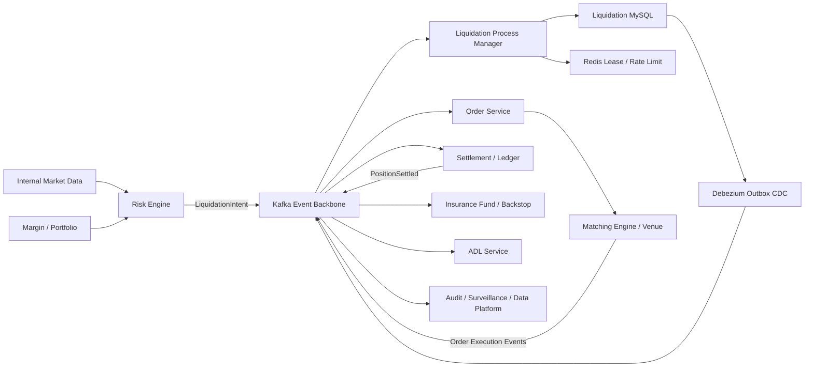

# 大型衍生品交易所清算引擎升级设计方案

> 文档状态：Proposal / 待架构评审  
> 版本：1.0  
> 日期：2026-07-19  
> 适用项目：perp-liquidation-node  
> 目标读者：项目负责人、架构负责人、风险团队、订单团队、结算团队、SRE、安全与测试团队

## 1. 执行摘要

当前项目已经实现一个可靠的清算执行内核，包括 MySQL 状态机、Inbox/Outbox、Redis Streams、任务租约、Redis fencing、确定性订单 ID、订单未知状态恢复、订单与结算事件幂等、结果发布及双人审批。

当前项目尚不是大型衍生品交易所完整清算系统。它不负责保证金、账户权益、清算触发、保险基金、穿仓处理和 ADL，也尚未具备动态切片、清算前撤单、多风险单元、统一账户、组合保证金和多可用区生产部署能力。

本方案选择以下目标架构：

> Kafka 事件总线 + MySQL 清算 Process Manager + Transactional Inbox/Outbox + Debezium CDC + Redis 短期协调 + Kubernetes 多可用区部署。

核心决策：

1. 当前 Node.js 模块定位为 Liquidation Process Manager 和 Execution Orchestrator。
2. Risk Engine 负责保证金、权益、风险率、清算触发和清算数量。
3. Portfolio/Margin Service 是仓位、保证金、破产价格和清算授权的事实来源。
4. Order Service 是订单命令和订单状态的事实来源。
5. Settlement/Ledger 是余额与仓位账务的事实来源。
6. Kafka 负责持久业务事件，不承诺跨 Topic 全局顺序。
7. MySQL 是清算 Saga 当前状态的事实来源。
8. Redis 只用于租约、短期锁、限流和缓存，不作为资金状态事实来源。
9. 所有异步命令必须具有 Accepted/Rejected 回执、超时和查询恢复。
10. 所有生产能力采用 At-Least-Once + 业务幂等，不承诺分布式 Exactly-Once。

不建议先将核心链路全面迁移到 RabbitMQ 后再整体替换 Kafka。若 RabbitMQ 存在，可用于人工操作、延迟任务或短生命周期工作队列；核心清算、订单和结算事件直接以 Kafka 为目标主干。

## 2. 当前状态与差距

### 2.1 当前可复用能力

| 能力 | 当前状态 | 目标方案处理 |
|---|---|---|
| 清算 Task 状态机 | 已实现 | 扩展为完整 Saga + Operation 双层状态 |
| MySQL Inbox | 已实现 | 保留，适配 Kafka Topic/Partition/Offset |
| MySQL Outbox | 已实现 | 保留，发布方式升级为 Debezium CDC |
| Redis Streams | 已实现 | 迁移期双轨，最终退出核心事件主干 |
| Redis Risk Unit Lock | 已实现 | 保留为短期租约，不作为最终一致性保障 |
| MySQL Fencing | 已实现 | 扩展到 Order/Settlement 跨服务校验 |
| Decision Sequence | 已实现 | 保留并扩展 liquidation_epoch 与 saga_version |
| 确定性 client_order_id | 已实现 | 保留，作为 Order Service 幂等键 |
| UNKNOWN 订单恢复 | 已实现 | 扩展权威三态查询和分层超时 |
| 订单事件顺序 | 已实现 | 保留，并增加跨 Topic 状态门控 |
| 结算后完成 | 已实现 | 保留，扩展 Insurance/ADL 分支 |
| STATIC IOC 执行 | 已实现 | 扩展动态切片、撤单重挂和流动性策略 |
| 双人审批 | 已实现 | 扩展 RBAC、mTLS、审计和人工接管工作台 |

### 2.2 生产前必须补齐

| 类别 | 缺失能力 |
|---|---|
| 风险协作 | 清算授权、清算前撤单、撤单后保证金重算、风险单元版本 |
| 执行策略 | 部分清算、动态切片、盘口深度、撤单重挂、超时、冷却、价格带 |
| 订单协议 | 命令 Accepted/Rejected、Venue Accepted/Rejected、权威查询语义 |
| 资金兜底 | Insurance Fund、Backstop LP、穿仓挂账、ADL、人工接管 |
| 事件平台 | Kafka、Schema Registry、Debezium、跨 Topic 状态门控 |
| 可运维性 | SLO、CDC Lag、Consumer Lag、Parking、Replay、灾备演练 |
| 生产部署 | 多可用区、容量规划、自动扩缩、优雅 Rebalance、跨地域主备 |

## 3. 范围与非目标

### 3.1 本项目负责

- 接收已经由 Risk Engine 形成的清算意图。
- 对清算意图进行幂等、版本和顺序校验。
- 编排撤单、保证金重验、清算额度预留、订单执行和结算确认。
- 生成 reduce-only 清算订单，并控制切片、价格和超时。
- 跟踪订单命令、撮合订单和结算三个层级状态。
- 处理未知状态、超时、重复、乱序和服务故障。
- 触发 Insurance Fund、Backstop 和 ADL 流程。
- 发布清算完成、失败、人工接管及审计事件。

### 3.2 本项目不负责

- 初始保证金和维持保证金计算。
- 账户权益、未实现盈亏和 Funding 计算。
- 清算价格和破产价格计算。
- 高频逐 tick 风险扫描。
- 撮合成交。
- 余额、仓位和总账记账。
- 保险基金账务和 ADL 排名计算。

## 4. 目标系统架构



### 4.1 架构风格

采用事件驱动的中央编排模式：

- Liquidation Process Manager 持有完整清算 Saga 状态。
- 其他服务发布自身已经发生的事实事件。
- 不采用完全去中心化的事件编舞处理资金状态。
- 不采用完整 Event Sourcing；Kafka 保留事件日志，MySQL 保存当前状态和审计索引。
- 同步 HTTP/gRPC 仅用于只读查询、管理 API 或明确要求低延迟且具备权威一致性语义的接口。

## 5. 服务边界和状态所有权

| 服务 | 唯一写入状态 | 对外能力 |
|---|---|---|
| Risk Engine | 风险判断、清算意图、decision_sequence | LiquidationIntent |
| Margin/Portfolio | 保证金、仓位、破产价、清算授权 | Reserve/Release Liquidation Capacity |
| Liquidation Engine | Saga、Operation、执行计划、恢复状态 | 清算编排和结果事件 |
| Order Service | 命令受理、订单、Venue 状态 | Accepted/Rejected/Query |
| Matching Engine | 撮合订单和成交 | Execution Events |
| Settlement/Ledger | 余额、仓位、账务版本 | PositionSettled |
| Insurance Fund | 保险基金额度与接管结果 | InsuranceTakeover Events |
| ADL Service | ADL 排名、指令与执行结果 | ADL Events |

任何资金状态只能有一个事实来源。Liquidation Engine 不直接修改 Portfolio、Order、Ledger 或 Insurance 的业务表。

## 6. 十四条不可绕过的架构约束

1. Kafka 只保证单 Topic 单 Partition 内顺序，不假设跨 Topic 全局顺序。
2. 所有异步 Command 必须有 Accepted/Rejected 回执。
3. 状态更新和 Outbox 必须在同一个 MySQL 事务内提交。
4. Redis 只做租约，MySQL fencing、版本和唯一约束是最终防线。
5. 限流只能背压、延迟或暂存，不能静默丢弃清算任务。
6. Saga 状态与单次 Command/Order Operation 状态必须分离。
7. 所有外部动作必须有幂等键、超时、权威查询和补偿流程。
8. Insurance、ADL、Settlement 必须具有失败和人工接管出口。
9. 系统采用 At-Least-Once + 业务幂等，不宣称分布式 Exactly-Once。
10. 任一状态不能因进程、Kafka、Redis 或单节点故障永久无声卡住。
11. Outbox/CDC 只保证最终发布；Kafka 可见延迟必须具有独立 SLO、监控和补偿。
12. 背压必须隔离故障域；单 Key 故障禁止 Pause 整个 Partition。
13. 下单、成交和结算恢复查询必须访问权威强一致状态；非最终 Not Found 视为 UNKNOWN。
14. 任何以一致性换延迟、以局部语义换全局语义的决策必须登记 ADR、代价、SLO、监控和退出条件。

## 7. Kafka 设计

### 7.1 集群基线

| 配置 | 生产基线 |
|---|---|
| Broker | 5 个，分布在 3 个可用区 |
| Controller | KRaft 3 或 5 节点 |
| Replication Factor | 3 |
| min.insync.replicas | 2 |
| Producer ACK | acks=all |
| Producer Idempotence | 开启 |
| Compression | ZSTD 或 LZ4 |
| Schema | Protobuf + Schema Registry |
| 磁盘 | 独立 NVMe，不与应用混部 |
| 跨地域 | 第一阶段单写主区域 + 异地热备 |

优先采用托管 Kafka；自建 Kafka 必须有独立平台团队负责容量、升级、磁盘、Controller、跨集群复制和故障演练。

### 7.2 Topic 规划

| Topic | Key | 建议初始分区 | 保留期 | 用途 |
|---|---|---:|---:|---|
| risk.liquidation-intents.v1 | risk_unit_id | 48 | 30 天 | 风险清算意图 |
| liquidation.commands.v1 | risk_unit_id | 48 | 14 天 | 内部清算命令 |
| liquidation.events.v1 | risk_unit_id | 48 | 90 天 | 清算 Saga 事件 |
| orders.commands.v1 | risk_unit_id | 96 | 14 天 | 撤单、下单和查询命令 |
| orders.events.v1 | risk_unit_id | 96 | 90 天 | 命令回执和订单状态 |
| settlement.events.v1 | risk_unit_id | 96 | 180 天 | 仓位和资金结算事件 |
| insurance.commands.v1 | risk_unit_id | 24 | 30 天 | 保险基金接管命令 |
| insurance.events.v1 | risk_unit_id | 24 | 180 天 | 保险基金结果 |
| adl.commands.v1 | settlement_asset | 24 | 30 天 | ADL 命令 |
| adl.events.v1 | settlement_asset | 24 | 180 天 | ADL 结果 |
| operations.commands.v1 | target_id | 12 | 30 天 | 人工操作命令 |
| *.retry.v1 | 与原 Topic 相同 | 同原 Topic | 7 天 | 可重试事件 |
| *.dlq.v1 | 与原 Topic 相同 | 12 | 90 天 | 无法自动恢复事件 |

分区数是初始基线，不是最终容量结论。上线前必须根据峰值意图数量、订单事件放大系数、单事件大小、消费者处理时间和三年增长进行压测。

### 7.3 分区与顺序

- 清算、订单和结算事件必须携带 risk_unit_id。
- 同一 risk_unit_id 在同一 Topic 内进入同一 Partition。
- 跨 Topic 不依赖 Kafka 顺序，依赖 order_event_sequence、position_version、decision_sequence 和 saga_version。
- 大户热点不能通过随机 Key 拆散；可为热点风险单元建立独立 Topic/Partition 或拆分经业务确认的子风险单元。
- 使用 Cooperative Sticky Rebalance 和 Static Membership 降低 Rebalance 冲击。

## 8. 统一消息协议

### 8.1 Event Envelope

```protobuf
message EventEnvelope {
  string event_id = 1;
  string event_type = 2;
  uint32 event_version = 3;
  string aggregate_type = 4;
  string aggregate_id = 5;
  string risk_unit_id = 6;
  uint64 sequence = 7;
  string correlation_id = 8;
  string causation_id = 9;
  int64 occurred_at_ms = 10;
  string producer = 11;
  bytes payload = 12;
}
```

### 8.2 Command Envelope

```protobuf
message CommandEnvelope {
  string command_id = 1;
  string command_type = 2;
  uint32 command_version = 3;
  string target_service = 4;
  string aggregate_id = 5;
  string risk_unit_id = 6;
  string correlation_id = 7;
  string causation_id = 8;
  uint64 expected_version = 9;
  uint64 fencing_token = 10;
  int64 expires_at_ms = 11;
  bytes payload = 12;
}
```

### 8.3 契约治理

- 禁止删除已发布字段。
- 禁止修改已发布字段语义。
- 新字段默认 optional，并提供默认处理。
- 破坏性变化必须发布新版本 Topic 或新 Message Version。
- 金额和数量使用 Decimal 字符串或统一定点整数，禁止 float/double。
- 每个契约必须有 Producer、Consumer、兼容性和弃用负责人。

## 9. Command 回执与订单状态

PlaceOrderRequested 后必须区分三级状态：

```text
OrderCommandAccepted / OrderCommandRejected
OrderSubmitted
OrderVenueAccepted / OrderVenueRejected
OrderPartiallyFilled / OrderFilled / OrderCancelled
```

语义：

- OrderCommandAccepted：Order Service 已持久化并接受 command_id。
- OrderSubmitted：订单已经提交给撮合或外部 Venue。
- OrderVenueAccepted：Venue 已创建订单。
- OrderFilled：订单已经成交。
- PositionSettled：Ledger 已推进仓位与账务版本。

不得使用一个 OrderAccepted 同时表达命令受理和 Venue 受理。

### 9.1 分层超时

| 超时 | 状态 | 补偿 |
|---|---|---|
| T1 | 未收到 OrderCommandAccepted | 查询 command_id，使用相同 command_id 幂等重发 |
| T2 | 命令已受理，无 Venue 状态 | 按 client_order_id 权威查询，禁止新 ID 重下 |
| T3 | 已成交，无 PositionSettled | 发起 SettlementReconciliationRequested |
| T4 | Insurance/ADL 无结果 | 熔断并进入 MANUAL_INTERVENTION |

具体时间阈值按市场、资产和下游 SLA 配置，不写死在代码中。

## 10. Saga 与 Operation 状态模型

### 10.1 Saga 主状态

```text
INTENT_RECEIVED
CANCELLING_RISK_ORDERS
REVALIDATING_MARGIN
RESERVING_LIQUIDATION_CAPACITY
PLANNING
EXECUTING
WAITING_SETTLEMENT
BACKSTOP_PROCESSING
RESULT_PUBLISHING
COMPLETED
FAILED
MARKET_HALTED
ACCOUNT_QUARANTINED
MANUAL_INTERVENTION
```

### 10.2 Operation 状态

```text
CREATED
OUTBOX_PENDING
COMMAND_PUBLISHED
COMMAND_ACCEPTED
COMMAND_REJECTED
SUBMITTED
VENUE_ACCEPTED
PARTIALLY_FILLED
FILLED
CANCELLED
UNKNOWN
RECONCILING
SETTLED
```

Saga 与 Operation 分开持久化，避免将命令已发、命令受理、Venue 受理、成交和结算混为一个状态。

### 10.3 提前事件处理

结算事件先于 OrderFilled 到达时：

1. 写入 Inbox。
2. 标记 WAITING_DEPENDENCY。
3. 不直接失败，不静默 ACK 丢弃。
4. OrderFilled 到达后重新调度。
5. 使用 position_version 和 operation sequence 再次校验。

## 11. 本地事务与 Outbox/CDC

标准消费者事务：

```sql
BEGIN;

INSERT INTO inbox_events (...);

UPDATE liquidation_sagas
SET state = ?, saga_version = saga_version + 1
WHERE saga_id = ? AND saga_version = ?;

INSERT INTO liquidation_operations (...);
INSERT INTO outbox_messages (...);

COMMIT;
```

提交 Kafka Offset 的条件：MySQL 事务已经成功。若提交 Offset 前崩溃，消息会重复投递，由 Inbox 拦截。

### 11.1 CDC 发布

- Debezium 读取 MySQL Binlog 中的 Outbox。
- Kafka Connect 将 Outbox 记录路由到目标 Topic。
- Outbox 发布后可异步标记或按保留策略归档。
- 业务代码不在 MySQL 事务内直接调用 Kafka。

### 11.2 Outbox 可见性 SLO

Outbox 只保证最终发布，不保证立即可见。必须监控：

```text
outbox_to_kafka_visibility_ms
outbox_oldest_pending_age_ms
debezium_source_lag_ms
debezium_binlog_position_lag
kafka_connect_failed_records_total
critical_command_publish_timeout_total
```

建议初始目标：P0 命令 Outbox 到 Kafka 可见 P99 小于 100ms，最终数值由生产等价压测决定。

### 11.3 低延迟旁路

默认不启用双发布旁路。优先使用：

```text
写 Outbox并提交
→ 发送非权威 wake-up signal
→ Relay 立即读取 Outbox
→ CDC 继续作为最终兜底
```

若确需 Commit 后直接 Kafka Publish + CDC 双路径，必须使用相同 event_id、允许重复、处理乱序、记录 publish_path，并单独通过 ADR 和资金安全评审。

## 12. Redis、Fencing 与并发安全

采用三层保护：

1. Kafka risk_unit_id 分区降低正常并发。
2. Redis Lease 防止短期并发执行。
3. MySQL fencing、乐观锁和唯一约束阻止旧 Worker 写入或下单。

建议唯一约束：

```text
UNIQUE(risk_unit_id, liquidation_epoch)
UNIQUE(command_id)
UNIQUE(client_order_id)
UNIQUE(aggregate_id, event_sequence)
UNIQUE(saga_id, operation_type, operation_sequence)
```

Order Service、Settlement 和 Portfolio 必须校验 fencing_token 或 liquidation authorization，不能只在 Liquidation Engine 内检查。

## 13. 清算授权

Portfolio/Margin Service 必须提供清算额度预留：

```text
authorization_id
risk_unit_id
position_id
position_version
maximum_quantity
fencing_token
expires_at
```

授权要求：

- 预留后限制用户订单与清算订单的并发冲突。
- Order Service 校验 authorization_id、数量和 fencing token。
- Settlement 校验 authorization_id 和 position_version。
- 授权过期后禁止新下单，但已经成交部分必须继续结算。
- 清算完成、失败或人工终止后显式释放授权。

## 14. 权威恢复查询

用于决定是否重新下单、抑制下单或确认结算的查询必须访问权威状态：

- Order Service 主状态库。
- Matching Engine 权威订单日志。
- Settlement/Ledger 主账。
- 明确支持 Read-Your-Writes 或线性一致读取的接口。

禁止使用 Elasticsearch、缓存、数据仓库、异步读模型或延迟只读副本作资金决策。

查询结果使用三态：

```text
FOUND
NOT_FOUND_FINAL
UNKNOWN
```

只有 NOT_FOUND_FINAL 才允许使用相同 command_id/client_order_id 进入明确补偿。外部 Venue 普通 Not Found 默认视为 UNKNOWN。

权威查询响应至少包含：

```text
query_source
as_of_sequence
as_of_time
final
command_id
client_order_id
```

## 15. 背压、限流和 Parking

### 15.1 原则

- 非法业务命令可拒绝并产生明确 Rejected Event。
- 临时容量不足不能丢弃，只能延迟或暂存。
- 全局故障可 Pause Partition/Consumer。
- 单 risk_unit_id 故障禁止 Pause 整个 Partition。

### 15.2 消费加暂存

```text
Kafka Consumer
→ Inbox
→ Deferred/Parking Table
→ COMMIT
→ Commit Kafka Offset
→ Priority Scheduler 恢复
```

Parking 记录：

```text
event_id
risk_unit_id
topic
partition
offset
reason
retry_class
next_attempt_at
parked_at
parked_by
resume_policy
resumed_at
resumed_by
```

恢复必须产生 EventParked、EventResumeRequested、EventResumed 或 EventMovedToManualIntervention 审计事件。

### 15.3 限流维度

- 单 risk_unit_id。
- 单账户。
- 单市场。
- 单结算币种。
- Order Service 全局容量。
- Venue 请求配额。
- Insurance/ADL 容量。

高风险任务优先，但必须防止普通风险任务永久饥饿。

## 16. 执行策略升级

### 16.1 生产前最低能力

- 清算前撤销风险订单。
- 撤单后保证金和仓位版本重验。
- 部分清算而不是默认全量平仓。
- IOC 未成交剩余量重试。
- 价格带、最小数量、最小名义价值校验。
- 订单最大生命周期和撤单超时。
- 标记价格、指数价格和盘口异常熔断。

### 16.2 ADAPTIVE 策略

- 按盘口可成交深度切片。
- 按风险等级调整执行速度。
- 限制单切片市场冲击。
- 动态调整保护价格但不得突破风险边界。
- 支持撤单、重新报价和冷却窗口。
- 支持 Market/Venue 降级和路由。

### 16.3 极端行情

- 市场暂停后进入 MARKET_HALTED。
- 订单簿失真时禁止继续自动扩大滑点。
- 超过最大执行窗口后转 Insurance/Backstop。
- 保险基金不足转 ADL。
- ADL 失败转 MANUAL_INTERVENTION 和 LOSS_SUSPENSE_POSTED。

## 17. Insurance、Backstop 与 ADL

必须定义完整命令和回执：

```text
InsuranceTakeoverRequested
InsuranceTakeoverAccepted
InsuranceTakeoverRejected
InsurancePositionSettled
InsuranceExhausted

ADLRequested
ADLAccepted
ADLInProgress
ADLCompleted
ADLFailed
```

人工出口：

```text
MANUAL_INTERVENTION
ACCOUNT_QUARANTINED
MARKET_HALTED
LOSS_SUSPENSE_POSTED
```

进入人工状态后：冻结自动重复下单、保留风险敞口快照、触发 P0 告警，并要求双人审批恢复、接管或终止。

## 18. Kubernetes 与基础设施部署

### 18.1 应用部署

| 组件 | 部署方式 | 扩缩依据 |
|---|---|---|
| Liquidation API | 独立 Deployment，最少 3 副本 | HTTP QPS/CPU |
| Intent Consumer | 独立 Deployment | Kafka Lag/KEDA |
| Order Event Consumer | 独立 Deployment | Kafka Lag/KEDA |
| Settlement Consumer | 独立 Deployment | Kafka Lag/KEDA |
| Recovery Scheduler | 独立 Deployment，固定低并发 | Parking/UNKNOWN 数量 |
| Operation API | 独立内部 Deployment | 管理 QPS |
| Debezium Connect | 3 副本 Connect 集群 | Connector Lag |

要求：

- 跨 3 个可用区反亲和部署。
- 配置 PodDisruptionBudget。
- 使用 Guaranteed/Burstable 明确资源等级。
- 资金主链路 Pod 与普通后台任务分离节点池。
- Consumer 停止前 Pause 拉取、完成当前事务、提交 Offset，再退出。
- 使用 Cooperative Rebalance，避免大规模任务抖动。
- HPA/KEDA 扩容必须受 Partition 数和下游容量上限约束。

### 18.2 数据基础设施

| 组件 | 建议 |
|---|---|
| MySQL | 托管高可用或 InnoDB Cluster，3 AZ，开启 PITR |
| Kafka | 托管 Kafka 或独立 5 Broker 集群 |
| Redis | Cluster/Sentinel，3 主 3 从，只存短期协调状态 |
| Schema Registry | 3 副本 |
| Object Storage | 归档 Kafka 事件、审计和回放数据 |
| Secrets | KMS/Vault，禁止环境文件长期保存生产凭证 |

### 18.3 跨地域

- 第一阶段单写主区域 + 异地热备。
- 不在第一阶段实现资金状态双主 Active-Active。
- 跨集群复制 Kafka 事件。
- MySQL 使用异地复制与明确的 fencing/region epoch。
- 灾备切换必须阻止两个区域同时执行相同 risk_unit_id。
- 建议目标：RPO 小于 5 秒，RTO 小于 5 分钟，最终由业务确认。

## 19. 安全与操作治理

- 所有服务间调用采用 mTLS。
- Kafka 使用 TLS、SASL 和最小权限 ACL。
- Topic 按 Producer/Consumer 白名单授权。
- Operator 身份由可信网关注入，禁止直接信任外部 Header。
- 取消任务、强制恢复、Outbox 重放、人工接管和市场 Kill Switch 使用双人审批。
- 所有审批、状态修改、重放和手工查询写入不可变审计日志。
- 生产配置必须通过启动前校验，不允许鉴权为空或使用默认凭证。

## 20. 可观测性与 SLO

### 20.1 关键指标

```text
liquidation_intent_to_command_accepted_ms
liquidation_intent_to_first_order_ms
liquidation_total_completion_ms
outbox_to_kafka_visibility_ms
kafka_consumer_lag
kafka_rebalance_total
tasks_by_saga_state
operations_by_status
unknown_order_attempts
lease_renewal_failures
fencing_conflicts
settlement_wait_duration_ms
parked_event_oldest_age_ms
insurance_fund_usage
adl_trigger_total
manual_intervention_total
```

### 20.2 初始 SLO 建议

| SLI | 初始目标 |
|---|---|
| 核心清算服务月可用性 | 99.99% |
| P0 Outbox 到 Kafka 可见性 | P99 < 100ms，压测确认 |
| 清算意图无声卡住 | 0 |
| 重复业务副作用 | 0 |
| UNKNOWN 状态首次告警 | 1 秒内 |
| Parking 最老任务 | 按风险等级分层告警 |
| 审批操作审计覆盖 | 100% |

所有日志、Trace 和指标携带 risk_unit_id、saga_id、task_id、command_id、client_order_id 和 correlation_id。

## 21. ADR 架构治理

任何以一致性换延迟、以本地语义换全局语义的设计必须登记 ADR。

ADR 模板：

```text
决策名称
适用范围
业务目标
被弱化的一致性语义
最坏故障场景
资金风险
延迟/吞吐收益
SLO/SLI
监控与告警
补偿与人工流程
回滚方案
验证测试
责任人
复审日期
退出条件
```

首批必须完成的 ADR：

1. Kafka Topic、Partition Key 和顺序语义。
2. Inbox/Outbox 与 Offset 提交语义。
3. Debezium CDC 可见性 SLO。
4. Redis Lease 与 MySQL Fencing。
5. Command Accepted/Rejected 协议。
6. 权威恢复查询和 UNKNOWN 语义。
7. Parking、Pause 和恢复审计。
8. 低延迟旁路是否启用。
9. 多可用区和跨地域写入模型。
10. Insurance/ADL/人工接管状态。

## 22. 测试与验证体系

### 22.1 自动化测试

- Domain 状态机和金额计算单元测试。
- Protobuf 契约兼容性测试。
- MySQL、Kafka、Redis 和 Debezium 集成测试。
- Producer/Consumer Contract Test。
- Inbox/Outbox 重复、乱序和崩溃点测试。
- 权威查询 FOUND/NOT_FOUND_FINAL/UNKNOWN 测试。
- Parking 和人工恢复审计测试。

### 22.2 故障注入

- MySQL 提交成功、Kafka 尚未发布时进程崩溃。
- Kafka消息重复、乱序、延迟和 Consumer Rebalance。
- Redis 主从切换、租约过期和旧 Worker 继续执行。
- OrderCommandAccepted 丢失。
- OrderSubmitted 后 Order Service 崩溃。
- OrderFilled 已发生但事件延迟。
- Settlement 已提交但回执丢失。
- Debezium Connector 停止和 Binlog 积压。
- 单可用区、Kafka Broker、MySQL 主节点故障。
- Insurance Exhausted 和 ADL Failed。

### 22.3 上线前验证

- 历史行情和历史清算事件回放。
- Shadow Mode：生成计划但不发真实订单。
- 与现有风险/清算结果逐笔对账。
- 峰值 3 至 5 倍流量压力测试。
- 24 至 72 小时稳定性测试。
- 全链路灾备切换演练。

## 23. 迁移路线

### Phase 0：架构冻结，预计 2 至 3 周

交付：

- 服务边界和状态所有权。
- 十四条架构约束。
- Kafka Topic/Partition 设计。
- Protobuf Envelope。
- Saga/Operation 状态机。
- 首批 ADR。
- SLO 和容量模型。

验收：风险、订单、结算、架构、SRE 和安全负责人共同签字。

### Phase 1：Kafka 基础与双轨，预计 4 至 6 周

交付：

- EventBus 抽象。
- Kafka Producer/Consumer Adapter。
- Schema Registry 和 Protobuf CI。
- Redis Streams + Kafka 双发。
- Kafka Shadow Consumer。

验收：双轨事件数量、内容、顺序和最终状态一致，无消息丢失。

### Phase 2：Outbox CDC，预计 4 至 6 周

交付：

- Debezium Outbox Connector。
- Topic Router。
- CDC Lag、Outbox Age 和 Connector 告警。
- Replay 与 Recovery Relay。

验收：故障注入下状态和事件最终一致，P0 可见性达到 SLO。

### Phase 3：Kafka 主链路，预计 4 至 8 周

交付：

- Intent、Order、Settlement Consumer 切换 Kafka。
- Command Accepted/Rejected 协议。
- 跨 Topic 状态门控。
- Parking Store 和 Priority Scheduler。
- Redis Streams 只读观察和回滚能力。

验收：Shadow 对账通过，可一键回退 Redis Streams，连续运行无状态分歧。

### Phase 4：生产级执行策略，预计 8 至 12 周

交付：

- 清算前撤单。
- 清算额度授权。
- 部分清算。
- ADAPTIVE 动态切片。
- 撤单重挂、冷却和执行窗口。
- 价格带、熔断和流动性保护。

验收：历史行情回放、极端行情仿真和 Shadow Mode 对账通过。

### Phase 5：Insurance、Backstop 和 ADL，预计 8 至 12 周

交付：

- Insurance Command/Event。
- Backstop LP 接口。
- ADL Command/Event。
- 穿仓挂账和人工接管。
- 双人审批工作台。

验收：保险基金不足、ADL 失败和人工恢复场景完整闭环。

### Phase 6：大型交易所部署，预计 6 至 10 周

交付：

- 3 AZ Kubernetes 部署。
- 托管/独立 Kafka 生产集群。
- MySQL 高可用和异地恢复。
- KEDA、PDB、反亲和和节点池隔离。
- 全链路 OpenTelemetry。
- 容量、混沌和灾备演练。

验收：达到 SLO、RPO/RTO、峰值容量和故障演练要求后才能生产放量。

时间估算基于跨团队并行实施，实际排期取决于 Risk、Order、Settlement、Kafka 平台和 SRE 团队是否同步投入。

## 24. 上线门槛

以下条件全部满足才能进入真实资金生产：

- 服务边界和所有 ADR 已审批。
- Kafka、MySQL、Redis、Debezium 多可用区部署完成。
- 所有异步命令具有 Accepted/Rejected 和超时恢复。
- Order/Settlement 权威查询支持三态和最终性语义。
- 清算授权跨 Order/Settlement 校验。
- Inbox/Outbox/CDC 故障注入通过。
- 任何单 Key 故障不会阻塞整个 Partition。
- Insurance、ADL、人工接管具有完整终态。
- 历史事件回放和 Shadow Mode 对账通过。
- 峰值 3 至 5 倍压测通过。
- 单 AZ、Kafka Broker、MySQL 主节点故障演练通过。
- P0/P1 告警、Runbook 和 7x24 值班机制就绪。
- 安全、合规、风险、账务和 SRE 联合签字。

## 25. 团队与责任建议

| 工作流 | 主要负责人 | 必须参与 |
|---|---|---|
| 清算 Saga 与策略 | Liquidation Team | Risk、Order、Settlement |
| 保证金与授权 | Risk/Margin Team | Liquidation、Ledger |
| 订单命令与权威查询 | Order Team | Matching、Liquidation |
| 结算与账务版本 | Settlement/Ledger Team | Risk、Liquidation |
| Kafka/CDC | Platform Team | SRE、Liquidation |
| Insurance/ADL | Risk Operations | Ledger、Liquidation |
| 多 AZ/灾备 | SRE | Platform、DBA、安全 |
| 契约与回放测试 | QA/Architecture | 所有领域团队 |

建议设立一名清算域架构负责人，对 Saga、事件协议、跨服务一致性和生产上线门槛拥有最终技术责任。

## 26. 项目负责人需要确认的决策

1. 是否确认 Kafka 作为核心业务事件主干，RabbitMQ 不进入核心清算链路。
2. 是否确认 Node.js 仅承担清算 Process Manager，不承担高频 Risk 和 Ledger。
3. 是否确认第一阶段采用单区域多 AZ，跨地域主备而非双主。
4. 是否采用托管 Kafka、托管 MySQL 和托管 Schema Registry。
5. 是否确认 Protobuf + Schema Registry 作为内部事件标准。
6. 是否确认 Debezium CDC 为 Outbox 主发布方式。
7. 是否批准 Risk、Order、Settlement、Platform、SRE 同步投入 Phase 0。
8. 是否确认 Insurance/ADL 是生产放量前能力，而不是上线后补充。
9. 是否接受先 Shadow Mode、再小流量、最后逐市场放量的发布策略。
10. 是否批准十四条架构约束作为不可绕过的评审清单。

## 27. 最终建议

当前代码可以继续作为清算执行内核演进，不建议重写。近期不应优先增加更多订单策略，而应先完成 Phase 0 至 Phase 3：固定服务边界、事件协议、Kafka、命令回执、Outbox CDC、权威恢复查询、Parking 和生产 SLO。

完成事件主干和一致性基础后，再开发部分清算、动态切片、Insurance 和 ADL。这样业务能力增加时不会反复修改底层通信、一致性和部署架构。

项目负责人批准后，第一项正式工作应是组织 Risk、Order、Settlement、Liquidation、Platform 和 SRE 的 Phase 0 架构工作坊，并在 2 至 3 周内完成 ADR、事件契约、状态机、SLO 和跨团队接口冻结。
