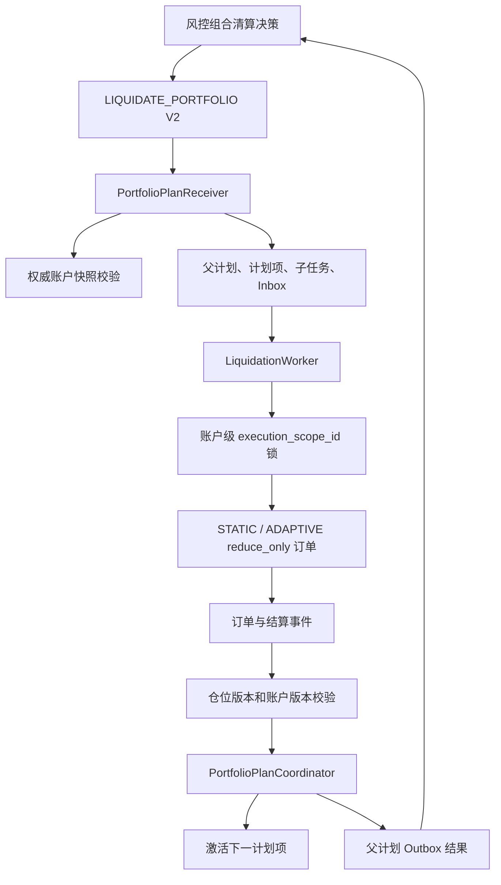

# 阶段四：账户级组合清算与生产化

## 1. 阶段目标与职责边界

阶段四解决全仓和组合保证金账户下的多仓位顺序执行问题，但不把账户风险计算放进清算引擎。

```text
风控系统：
- 计算账户风险、保证金缺口和清算资格。
- 决定仓位执行顺序、每项授权数量/名义价值和价格边界。
- 给出账户版本、决策序号和 STOP_ON_FAILURE 计划。

清算引擎：
- 校验账户与仓位快照。
- 在一个账户执行作用域内顺序激活子任务。
- 按风控授权执行 STATIC 或 ADAPTIVE reduce_only 订单。
- 每笔结算后精确推进账户版本。
- 失败时停止剩余计划并返回一个父计划结果。

清算引擎不做：
- 不计算保证金率、维持保证金、清算价或账户风险。
- 不自行调整仓位优先级。
- 不扩大授权数量、授权名义价值或价格边界。
- 不因为部分清算后风险仍高而自行继续清算。
```

## 2. 总体架构



核心对象：

- `PortfolioLiquidationCommand`：解析 V2 组合指令和各计划项授权。
- `PortfolioPlanReceiver`：幂等接收、账户校验、父子数据原子落库。
- `PortfolioLiquidationPlan`：账户级父计划状态。
- `PortfolioPlanItem`：风控指定顺序中的单个仓位执行项。
- `PortfolioPlanCoordinator`：完成当前项、激活下一项、停止失败计划和生成父结果。
- `OperatorActionService`：双人审批操作的执行与审计。

## 3. V2 组合指令

消息主题：

```text
risk.liquidation.portfolio.command
```

HTTP 接口：

```http
POST /api/v1/internal/liquidation/portfolio-plans
```

父级关键字段：

| 字段 | 约束 |
|---|---|
| `schema_version` | 必须为 `2` |
| `plan_id` | 父计划全局唯一 ID |
| `risk_decision_id` | 风控决策幂等键 |
| `risk_unit_id` | `account:{accountId}:settlement:{currency}` |
| `decision_sequence` | 同一账户风险单元严格单调递增 |
| `account_version` | 接收时必须与权威账户版本精确一致 |
| `margin_mode` | 当前支持 `CROSS` 和 `PORTFOLIO` 契约校验 |
| `max_total_authorized_notional` | 所有计划项授权名义价值之和不得超过该值 |
| `failure_mode` | 当前只允许 `STOP_ON_FAILURE` |
| `items` | 风控决定的有序仓位执行项，至少一项 |

每个计划项必须包含：

- 仓位 ID、仓位版本、合约、方向。
- 目标数量和最大可执行数量。
- 该项 `authorized_notional`。
- 破产价、最大偏离和行情最大年龄。
- 可选 STATIC/ADAPTIVE 执行策略。
- 风控决策时的仓位和行情快照。

每项必须满足 `target_quantity * risk_snapshot.mark_price <= authorized_notional`。
清算订单携带 `authorized_notional` 和 `notional_reference_price`，订单服务必须在接单时重复校验。

## 4. 数据结构

阶段四迁移：

```text
db/migrations/008_add_portfolio_liquidation.sql
db/integration/003_add_portfolio_reference_data.sql
```

主要表：

| 表 | 作用 |
|---|---|
| `liquidation_portfolio_plans` | 父计划、账户版本、执行进度和最终状态 |
| `liquidation_portfolio_plan_items` | 有序计划项、授权名义价值和子任务引用 |
| `liquidation_portfolio_plan_events` | 父计划状态变化与账户版本推进审计 |
| `liquidation_operator_actions` | 双人审批操作、审批号、原因和执行结果 |
| `liquidation_tasks` | 复用单仓位执行状态机，增加组合计划引用字段 |

`liquidation_tasks` 新增字段：

```text
execution_scope_id
portfolio_plan_id
plan_item_sequence
authorized_notional
```

`db/migrations/009_add_portfolio_scope_controls.sql` 增加账户作用域准入控制行，
用于在 MySQL 事务中串行化同一账户的组合计划接收。

`execution_scope_id` 对组合计划中的所有子任务都等于父级账户风险单元，保证同一账户结算币种下不会并行执行两个计划项。

## 5. 接收流程

1. 按 `risk_decision_id` 查重，重复指令返回原计划。
2. 检查同一 `risk_unit_id` 的 `decision_sequence` 是否更新。
3. 拒绝同一账户风险单元已有活动父计划的并发指令。
4. 从账户服务读取权威账户快照。
5. 精确校验账户 ID、用户 ID、账户版本、保证金模式和结算币种。
6. 校验计划项数量、仓位字段、授权数量和价格保护。
7. 校验每项授权名义价值以及父级总授权上限。
8. 在数据库事务中创建父计划、所有子任务、计划项和审计事件。
9. 只把第一项子任务置为 `PENDING`，后续任务置为 `PLAN_WAITING`。
10. 父计划进入 `EXECUTING`，当前项序号为 `1`。

## 6. 顺序执行与账户版本

父计划状态：

```text
EXECUTING -> COMPLETED
EXECUTING -> FAILED
EXECUTING -> CANCELLED
EXECUTING -> MANUAL_REVIEW
```

计划项状态：

```text
RUNNING -> COMPLETED
WAITING -> RUNNING -> COMPLETED
RUNNING -> FAILED
WAITING -> SKIPPED
RUNNING/WAITING -> CANCELLED
```

关键不变量：

1. 同一父计划任何时刻最多只有一个计划项可执行。
2. 后续项必须在前一项完成并确认结算后才能从 `PLAN_WAITING` 进入 `PENDING`。
3. 每笔组合计划订单都携带 `expected_account_version`。
4. 订单/结算服务必须原子校验该版本，并在结算成功后把账户版本精确增加 `1`。
5. 清算引擎只接受 `settlement.account_version == plan.current_account_version + 1`。
6. 账户版本未推进、跳号或重复时，不得激活下一笔子订单或下一计划项。
7. ADAPTIVE 子订单逐笔结算，因此一个仓位项可能推进多次账户版本。

真实验证中，BTC 项拆成两笔子订单、ETH 项一笔订单，账户版本从 `723875` 依次推进到 `723878`。

## 7. 失败与结果语义

当前只实现 `STOP_ON_FAILURE`：

- 当前项发生不可恢复失败时，当前计划项标记为 `FAILED`。
- 尚未执行的计划项标记为 `SKIPPED`，对应任务进入 `CANCELLED`。
- 父计划进入 `FAILED` 或 `MANUAL_REVIEW`。
- 不会继续执行后续仓位。
- 风控收到一个账户级父计划结果，再根据最新账户状态重新决策。

子任务完成时只更新父计划，不独立向风控发布结果。父计划终态只生成一个：

```text
topic = liquidation.execution.result
event_id = result_portfolio_{plan_id}
action = LIQUIDATE_PORTFOLIO
```

父结果包含账户初始/当前版本、计划状态和每项实际成交数量、均价、仓位版本及错误信息。

## 8. 受控操作与双人审批

以下操作必须通过 `OperatorActionService`：

```text
CANCEL_PORTFOLIO_PLAN
RECONCILE_TASK
REPLAY_OUTBOX
```

生产模式通过 `APPROVAL_SERVICE_URL` 验证审批号、操作、目标、操作人、审批人和有效期。
旧的任务级 `/reconcile`、`/replay-outbox` 端点固定返回 `403`。

每次操作要求：

- 唯一 `operation_id`，用于幂等。
- `operator_id` 与 `approver_id` 必须不同。
- 外部审批系统生成的 `approval_id`。
- 明确的操作原因。
- 完整保存请求、状态、结果和完成时间。

直接调用：

```http
POST /api/v1/internal/liquidation/portfolio-plans/{planId}/cancel
```

会返回 `403 dual_approval_required`，避免绕过审批审计。受控取消必须使用：

```http
POST /api/v1/internal/liquidation/operator-actions
```

## 9. 并发与数据库可靠性

组合计划完成第一项并激活下一项时，会与执行 Worker 的任务领取事务竞争。阶段四真实回归发现 MySQL deadlock 后，领取逻辑已加固：

- 候选查询不再使用 `LIMIT 20 FOR UPDATE` 批量锁定任务。
- 先读取最多 20 个候选 ID，再逐条按 `task_id` 精确 `FOR UPDATE`。
- 其他 Worker 抢先领取后，当前 Worker 重新校验状态并尝试下一个候选。
- MySQL `1205` 锁等待超时和 `1213` deadlock 最多重试 4 次。
- 使用短指数退避和随机抖动，减少多 Worker 同步重试。

当前使用 MySQL 5.7，因此没有依赖 `SKIP LOCKED`。升级 MySQL 8 后可以进一步评估 `FOR UPDATE SKIP LOCKED`，但仍需保留状态条件和账户执行作用域校验。

## 10. API 与查询

```http
POST /api/v1/internal/liquidation/portfolio-plans
GET  /api/v1/internal/liquidation/portfolio-plans/{planId}
GET  /api/v1/internal/liquidation/portfolio-plans/by-risk-decision/{riskDecisionId}
POST /api/v1/internal/liquidation/operator-actions
GET  /api/v1/internal/liquidation/operator-actions/{operationId}
```

计划查询返回：

- 父计划快照。
- 所有计划项和对应子任务。
- 父计划事件时间线。

## 11. 真实模式验证

启动服务：

```bash
docker compose -f docker-compose.real.yml up -d --force-recreate
```

组合顺序执行：

```bash
ruby bin/portfolio_mode_smoke
```

预期：BTC 两笔 ADAPTIVE 子订单、ETH 一笔 STATIC 订单、账户版本连续增加三次、只发布一个父结果。

双人审批取消：

```bash
docker compose -f docker-compose.real.yml stop liquidation-worker
ruby bin/portfolio_mode_smoke --cancel
docker compose -f docker-compose.real.yml start liquidation-worker
```

完整自动化测试：

```bash
ruby -Ilib -S rspec
```

阶段四完成时结果为 `84 examples, 0 failures`。

## 12. 上线前仍需外部系统共同完成

阶段四完成了清算服务侧的账户级顺序执行，但距离大型交易所生产能力仍需要跨系统建设：

- 风控、订单、仓位、账务服务共同落地账户版本和 fencing token 原子校验。
- 接入真实审批系统，校验 `approval_id` 的有效性、审批范围和有效期，而不是只保存字符串。
- 对 `risk_unit_id` 做消息分区，保证跨实例和跨机房顺序消费。
- 建立组合计划与账户账本的持续对账、告警和人工处置台。
- 执行极端行情容量测试、故障注入、MySQL 主从切换和 Redis/MQ 恢复演练。
- 评估多结算币种、PORTFOLIO margin 和统一保证金账户的版本模型。
